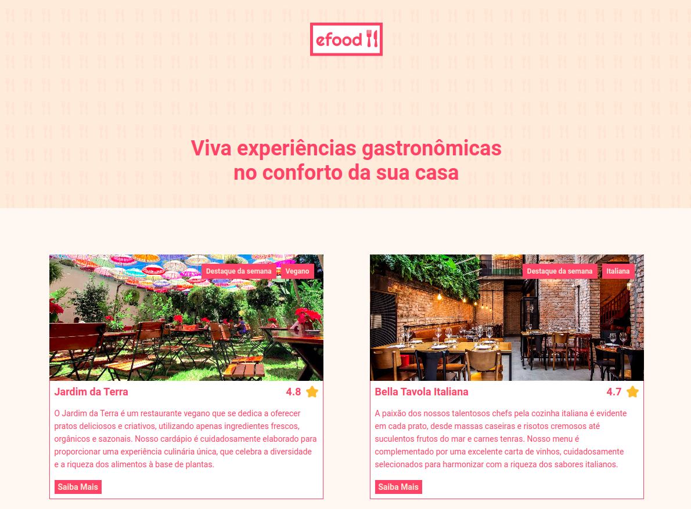

# Efood
Efood é um projeto desenvolvido no exercício do módulo final do curso de Desenvolvedor Full Stack Python da EBAC – Escola Britânica de Artes Criativas e Tecnologia. O objetivo foi criar uma aplicação seguindo fielmente o design especificado no Figma, utilizando uma stack de tecnologias modernas. O projeto inclui integração com APIs, gerenciamento de rotas utilizando React Router DOM, e controle de estados com Redux. Além de outras tecnologias usadas na criação dos formulários.

## Tecnologias usadas
**Setup**
 
&nbsp;
&nbsp;
&nbsp;
&nbsp;
 
**Controle de css**
 
&nbsp;
 
**Formulários**
 

 

## Link Demo: [Efood](https://efood-rosy.vercel.app/)

  

